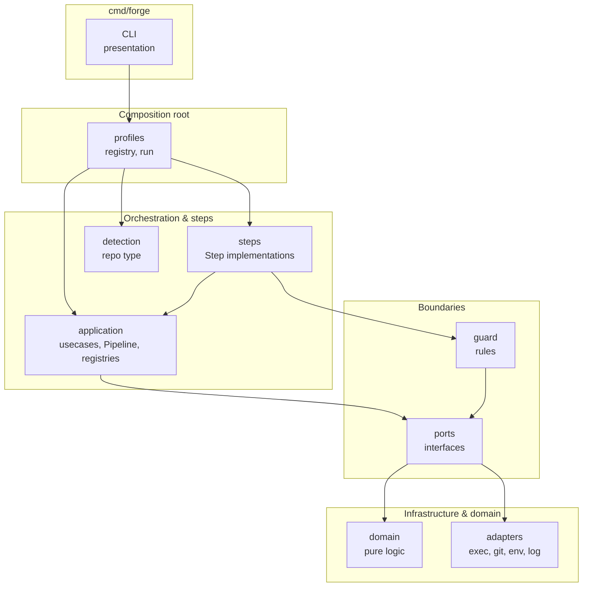
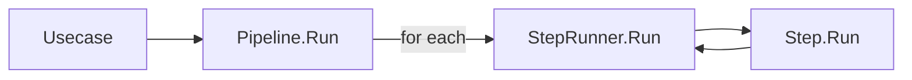
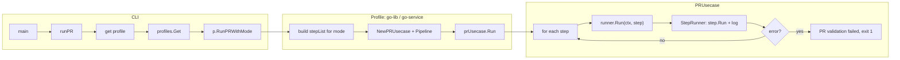
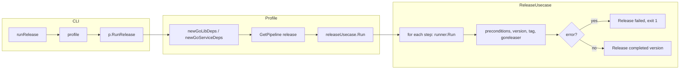
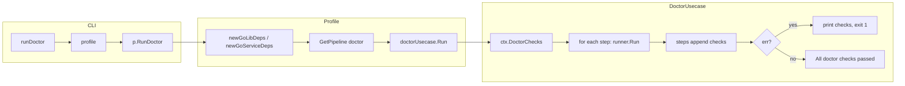
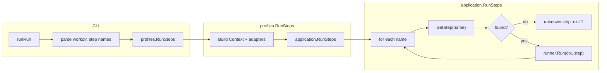
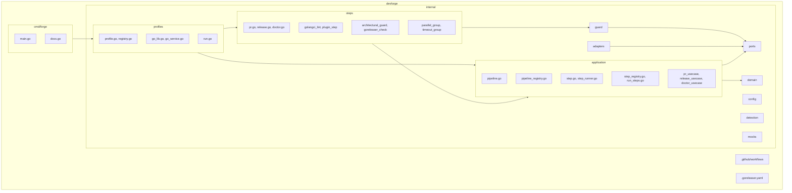

# DevForge — Architecture Report

This document describes the system design after the major refactor: hexagonal layering, pipeline and step model, profile system, and execution flow. No code changes are implied; this is an analysis document only.

---

## Overview

DevForge is a **policy engine** for CI/CD governance. It enforces:

- Deterministic release automation (semantic version from commits)
- Conventional commits and quality thresholds
- Hexagonal boundaries (domain → ports ← application; adapters implement ports)
- Profile-based flows (go-lib, go-service) with pipelines and steps

The system is structured so that:

1. **CLI** only parses args, selects a profile, and invokes profile entry points.
2. **Profiles** are the composition root: they wire adapters, register pipelines, and call application use cases.
3. **Application** holds use cases, Step/Pipeline abstractions, and registries; it depends only on ports and domain.
4. **Steps** implement the Step interface and register by name; they depend on application (and guard where needed).
5. **Domain** is pure logic (version, conventional commit, coverage, govulncheck); no IO.
6. **Ports** define interfaces; **adapters** implement them.

---

## Architecture Layers



### Dependency rules (validated)

| Layer        | May import              | Must NOT import        |
|-------------|-------------------------|-------------------------|
| **CLI**     | adapters/logger, application, config, detection, profiles | steps (does not import steps) |
| **profiles**| application, steps, adapters, guard             | domain (only via application) |
| **application** | ports, domain                          | adapters, steps              |
| **steps**   | application, guard (for rules)        | adapters (uses ctx.Cmd, ctx.Git from Context) |
| **ports**   | (none)                  | domain, application, adapters |
| **domain**  | stdlib only             | application, ports, adapters |
| **adapters**| ports                   | domain, application       |
| **guard**   | ports                   | adapters, application    |
| **detection** | stdlib (os, path/filepath)          | application, steps, profiles |

**Observations:**

- CLI loads `config.LoadConfig(workdir)` for `pr`, `release`, and `doctor`; profile and mode follow priority: flags → config → auto/default.
- CLI does not depend on steps; it uses `application.ListSteps()` for help and `profiles.RunSteps()` for the "run" command.
- Steps depend on **application** (Step interface, Context, RegisterStep); they receive ports via `*application.Context` and remain infrastructure-agnostic.
- Application does not import adapters; profiles inject adapters into use cases.
- Domain has no infrastructure dependencies; only stdlib and pure logic.

---

## Pipeline Model

### Pipeline

| Aspect   | Detail |
|----------|--------|
| **Location** | `internal/application/pipeline.go` |
| **Responsibility** | Named sequence of steps; runs in order via `Pipeline.Run(ctx, runner)`. |
| **Interaction** | Built by profiles (or from pipeline registry); held by use cases; steps are `[]Step`. |



```go
type Pipeline struct {
    Name  string
    Steps []Step
}

func (p Pipeline) Run(ctx *Context, runner *StepRunner) error
```

### Pipeline registry

| Aspect   | Detail |
|----------|--------|
| **Location** | `internal/application/pipeline_registry.go` |
| **Responsibility** | Register pipelines by name; retrieve by name; list names; run by name (`RunPipeline`). |
| **Interaction** | Profiles call `RegisterPipeline` in `init()`; `newGoLibDeps` / `newGoServiceDeps` call `GetPipeline("pr"|"release"|"doctor"|"go-service-pr")` to get the pipeline for use cases. |

- **Where pipelines are constructed:** In profile `init()`: go-lib registers `"pr"`, `"release"`, `"doctor"`; go-service registers `"go-service-pr"`, `"release"`, `"doctor"`. For PR with mode (quick/full/deep), profiles build step lists inline and pass `Pipeline{Name: "pr", Steps: stepList}` directly to the use case (no registry).
- **RunPipeline:** Looks up the pipeline by name, then runs `p.Run(ctx, runner)`. Used when execution is driven by pipeline name (e.g. future CLI or tooling).

---

## Step Model

### Step

| Aspect   | Detail |
|----------|--------|
| **Location** | `internal/application/step.go` |
| **Responsibility** | Interface for a single validation/execution unit: `Name() string`, `Run(ctx *Context) error`. |
| **Interaction** | Implemented in `internal/steps`; use cases and `RunSteps` run steps via StepRunner. |

Steps receive `*application.Context` (workdir, Cmd, Git, Log, Clock, etc.). They do not import adapters; they use the context’s port implementations.

### StepRunner

| Aspect   | Detail |
|----------|--------|
| **Location** | `internal/application/step_runner.go` |
| **Responsibility** | Runs one step, logs duration and success/failure (observability only). |
| **Interaction** | Built by use cases; each use case calls `runner.Run(ctx, step)` for each step in the pipeline. |

### Step registry

| Aspect   | Detail |
|----------|--------|
| **Location** | `internal/application/step_registry.go` |
| **Responsibility** | Map step name → constructor; `GetStep(name)` returns a new instance; `ListSteps()` for CLI help. |
| **Interaction** | Each step package calls `application.RegisterStep(name, ctor)` in `init()`. The "run" command uses `RunSteps(ctx, runner, stepNames)` which calls `GetStep` per name. |

### Where steps are implemented

All concrete steps live in **`internal/steps`**:

- **PR:** `pr.go` (go-mod-tidy, gofmt, govulncheck, test, test-race, conventional-commit, plus builders like `GoLibPRStepsFull`); `golangci_lint.go` (golangci-lint); `plugin_step.go` (PluginStep for config-defined plugins).
- **Release:** `release.go` (preconditions, version-derivation, create-tag, verify-tag, goreleaser).
- **Doctor:** `doctor.go` (git-installed, goreleaser-installed, full-history, branch-main, working-tree-clean, tags-accessible).
- **Quality/guard:** `architectural_guard.go`, `goreleaser_check.go`; static analysis is golangci-lint + govulncheck (no standalone staticcheck/gocyclo/gosec).
- **Composition:** `parallel_group.go`, `timeout_group.go` (and sequential group in pr.go).

Steps remain infrastructure-agnostic: they use only `*application.Context` (ports) and, where needed, `guard` for architectural rules.

### Repository configuration and plugins

- **Config:** `internal/config` provides `LoadConfig(workdir)`: reads `.syntegrity.yml` from the repo root; if the file is missing, returns default config (Profile "", Mode "full", Plugins nil). Used by the CLI before selecting profile/mode; CLI flags override config values.
- **Plugins:** Entries under `plugins` in `.syntegrity.yml` (each with `name` and `run`) are turned into `PluginStep` instances. Each plugin runs its `run` command via `bash -c`; non-zero exit fails the pipeline. Plugins run after the standard pipeline steps when the profile (or pipeline builder) appends them from config.

---

## Profile System

### Profile

| Aspect   | Detail |
|----------|--------|
| **Location** | `internal/profiles/profile.go` |
| **Responsibility** | Defines a CI profile by name and three entry points: `RunPRWithMode`, `RunRelease`, `RunDoctor`. |
| **Interaction** | Filled by go_lib and go_service; CLI gets profile by name and calls the appropriate function. |

### Profile registry

| Aspect   | Detail |
|----------|--------|
| **Location** | `internal/profiles/registry.go` |
| **Responsibility** | Map profile name → Profile; `Register(Profile)` in init; `Get(name)`; `List()` for help. |
| **Interaction** | Each profile’s `init()` registers itself and (in the same init) registers pipelines with the application pipeline registry. |

### How the CLI selects a profile

1. CLI loads repository config: `config.LoadConfig(workdir)` reads `.syntegrity.yml` if present (optional; default config if file missing).
2. **Priority:** CLI flags override config file; config overrides auto-detection/default.
3. **Profile:** If `--profile` is set → use it. Else if `config.Profile` is non-empty → use it. Else `detection.DetectProfile(workdir)` (go-service if `go.mod` + `cmd/`; else go-lib).
4. **Mode (pr only):** If `--mode` is set → use it. Else use `config.Mode` (default `"full"`).
5. `profiles.Get(profileName)` returns the profile; CLI then calls `p.RunPRWithMode`, `p.RunRelease`, or `p.RunDoctor`. Pipelines may append **plugin steps** from `config.Plugins` (see Plugins below).

### How pipelines differ between go-lib and go-service

- **go-lib:** Pipeline names `"pr"`, `"release"`, `"doctor"`. PR steps: `steps.GoLibPRStepsFull(...)` (e.g. complexity 15, 2m timeout, 94% coverage).
- **go-service:** Pipeline names `"go-service-pr"`, `"release"`, `"doctor"`. PR steps: `steps.GoServicePRStepsFull(...)` (e.g. complexity 20, 3m timeout, 80% coverage). Release and doctor steps are the same (`steps.ReleaseSteps()`, `steps.DoctorSteps()`).

---

## Execution Flow

### forge pr



For **release** and **doctor** (and default PR when using deps), profiles use **newGoLibDeps()** / **newGoServiceDeps()**, which call **GetPipeline("pr"|"release"|"doctor"|"go-service-pr")** and pass the pipeline into the use case. So pipeline execution is the same: use case iterates `pipeline.Steps` and runs each via StepRunner.

### forge release



### forge doctor



### forge run &lt;step&gt; [&lt;step&gt; ...]



Note: There is no step named `"lint"`; the command is `forge run <step> [<step>...]` with step names such as `gofmt`, `staticcheck`, `govet`. Listing is via `application.ListSteps()`.

---

## Extensibility Model

| Addition           | How |
|--------------------|-----|
| **New profile**     | Add a new package under `internal/profiles` (e.g. `go_app.go`). In `init()`, call `Register(Profile{Name: "go-app", RunPRWithMode: ..., RunRelease: ..., RunDoctor: ...})` and `application.RegisterPipeline(...)` for that profile’s pipelines. Detection can be extended in `internal/detection/repository.go` if the new profile should be auto-detected. |
| **New pipeline**   | In a profile’s `init()`, call `application.RegisterPipeline(Pipeline{Name: "my-pipeline", Steps: ...})`. Steps can come from existing step builders or new ones in `internal/steps`. |
| **New step**       | Add a file in `internal/steps` (e.g. `mystep.go`). Implement `application.Step` (Name, Run). In `init()`, call `application.RegisterStep("my-step", func() application.Step { return NewMyStep() })`. Use only `*application.Context` (and guard if needed). |
| **New CI command** | In `cmd/forge/main.go`: add a case in `dispatchCommand()`, add a `runX()` that uses profiles or application, add usage and help. No change to steps or domain required. |
| **Plugin (per-repo)** | Add entries under `plugins` in `.syntegrity.yml` with `name` and `run`; each becomes a `PluginStep` that runs `bash -c "<run>"`. No code change in DevForge; pipelines that support plugins append these steps after standard steps. |

---

## Repository Structure (by responsibility)



---

## Maintainability

- **Separation of concerns:** CLI vs profiles vs application vs steps vs domain/ports/adapters is clear; each layer has a single responsibility.
- **Coupling:** Application does not depend on steps or adapters; steps depend only on application (and guard); profiles are the only place that ties adapters + steps + application together.
- **Testability:** Use cases take interfaces (ports); tests use mocks and `application_test` with steps to avoid import cycles. Step tests live in `internal/steps` and use `*application.Context` with mocks.
- **Extensibility:** New profile, pipeline, step, or command can be added without changing core use case or domain logic.

---

## Potential Improvements (optional, low complexity)

- **RunPipeline usage:** `RunPipeline(name, ctx, runner)` exists but is not yet used by the CLI; it could be used by a future “run pipeline by name” command or by tests.
- **Init order:** Pipeline registration happens in profile `init()`; go-lib and go-service both register `"release"` and `"doctor"` (same steps). Order is stable within a package; no functional issue.
- **Doctor/Release pipeline names:** Currently `GetPipeline("release")` and `GetPipeline("doctor")` are shared across profiles; if a profile ever needed different release/doctor steps, it could register profile-scoped names (e.g. `"go-lib-release"`) and use those in deps.

---

## Summary

The refactored design is consistent with hexagonal architecture: domain is pure, application orchestrates via ports, steps implement the Step interface and register by name, and profiles act as the composition root and pipeline registrant. Pipeline execution is uniform (use case + StepRunner + steps); the "run" command uses the step registry only. The structure is suitable for maintenance and future extension.
